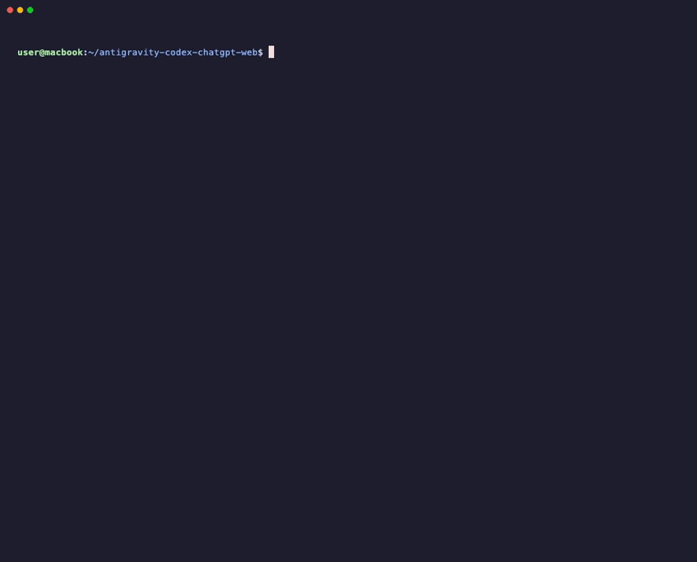
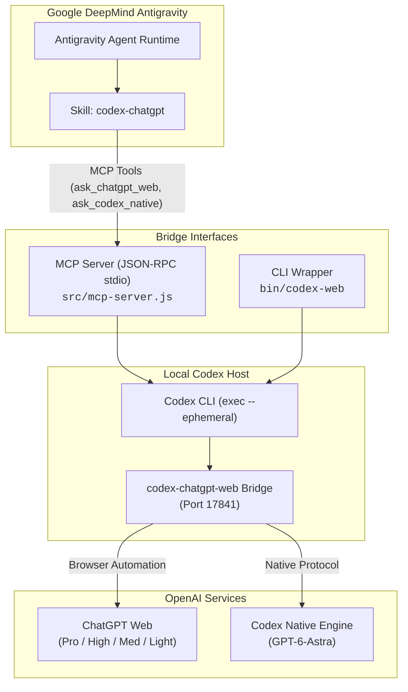

# Antigravity <-> Codex ChatGPT Web Bridge

[](https://opensource.org/licenses/MIT)
[](https://nodejs.org/)
[](https://modelcontextprotocol.io/)
[](#)

> Seamless bridge connecting **Google DeepMind Antigravity** coding agent to **ChatGPT Web (Pro, Extra High, High, Medium, Light)** and **Codex Native (GPT-6-Astra)** via the [`miuuyy/codex-chatgpt-web`](https://github.com/miuuyy/codex-chatgpt-web) local service.

<p align="center">
  
</p>

---

## 🌐 Language Navigation / Chọn Ngôn Ngữ
- [English Documentation](#-english-documentation)
- [Tài Liệu Tiếng Việt](#-tài-liệu-tiếng-việt)

---

# 🇬🇧 English Documentation

## Overview

`antigravity-codex-chatgpt-web` is a production-grade, zero-dependency bridge allowing **Google DeepMind Antigravity** agents to interact directly with your **ChatGPT Web (Pro / Plus)** subscription and **Codex Native** without incurring OpenAI API token costs.

## 🎬 Terminal Demo

The demo above captures an active terminal session:
1. **Connectivity Check**: Running `codex-web --status` verifies local bridge service health at `127.0.0.1:17841`.
2. **Antigravity Session Execution**: Running `agy "Ask ChatGPT Web Pro to optimize worker pool with Atomics"`.
3. **MCP Tool Routing**: Antigravity detects the `codex-chatgpt-web` MCP server and dispatches via `ask_chatgpt_web` using the `chatgpt-web/pro` reasoning model.
4. **Instant Zero-Cost Response**: Receives the deep reasoning explanation and typed implementation with **$0.00 token billing**.

### Key Highlights
- **Zero API Token Billing**: Leverages existing ChatGPT Web subscriptions.
- **Full Model Spectrum**: Supports `pro` (maximum reasoning depth), `extra-high`, `high`, `medium` (default), `light` (instant responses), and `gpt-6-astra` (Codex native coding).
- **Dual Interface**:
  - **MCP Server** (`src/mcp-server.js`): Fully conforms to the Model Context Protocol JSON-RPC standard for seamless Antigravity agent integration.
  - **CLI Helper** (`bin/codex-web`): Ergonomic terminal CLI with pipe support (`cat file | codex-web -m pro`).
- **Antigravity Skill**: Complete skill package (`skills/codex-chatgpt/SKILL.md`) for autonomous agent reasoning and code reviews.
- **Zero External Dependencies**: Pure Node.js built-ins (`child_process`, `readline`, `fs`, `path`).

---

## Architecture



---

## Model Comparison Matrix

| Model Alias | Target Identifier | Underlying Engine | Effort / Profile | Required Tier | Speed | Reasoning Depth | Recommended Use Cases |
| :--- | :--- | :--- | :---: | :---: | :---: | :---: | :--- |
| **`pro`** | `chatgpt-web/pro` | `gpt-5.6-sol` | `ultra` / `max` | **Pro Required** | Deliberate | **Maximum (Max Depth)** | Complex system architecture, formal proofs, multi-system tradeoffs |
| **`xhigh`** | `chatgpt-web/extra-high` | `gpt-5.6-sol` | `xhigh` | **Pro Required** | Moderate | Very High | Advanced mathematical modeling, complex algorithmic optimizations |
| **`high`** | `chatgpt-web/high` | `gpt-5.6-sol` | `high` | Plus / Pro | Moderate | High | In-depth code reviews, database indexing strategies, security audits |
| **`medium`** | `chatgpt-web/medium` | `gpt-5.6-sol` | `medium` | Plus / Pro | Fast | Balanced *(Default)* | General programming queries, explanations, everyday problem solving |
| **`light`** | `chatgpt-web/light` | `gpt-5.6-sol` | `low` (Instant) | Plus / Pro | Blazing Fast | Standard | Data reformatting, regex authoring, quick syntax conversions |
| **`think`** | `chatgpt-web/think` | `gpt-5.6-luna` | `medium` | Plus / Pro | Moderate | Medium | Fallback reasoning for accounts/sessions on the Luna track |
| **`luna`** | `chatgpt-web/luna` | `gpt-5.6-luna` | `low` (Instant) | Plus / Pro | Fast | Standard | Fallback instant response for accounts without the Sol selector |
| **`zero-risk`** | `chatgpt-web/zero-risk` | Manual Browser | Manual | Plus / Pro | Interactive | User-controlled | Manual browser submission mode where prompt input is verified in the UI |
| **`astra`** | `gpt-6-astra` | `gpt-6-astra` | Codex Native | Codex Daemon | Fast | High Code Specialization | Codex Native deep coding, comprehensive unit test generation, AST refactors |

---

## Quick Installation (1-Step)

Clone or enter the directory and run the one-click installer:

```bash
cd /Users/jang/Products/antigravity-codex-chatgpt-web
./install.sh
```

What the installer does automatically:
1. Verifies Node.js (>= 18), `codex` CLI, and port `17841`.
2. Makes scripts executable (`chmod +x`).
3. Symlinks `bin/codex-web` into `~/.gemini/antigravity/bin/codex-web`.
4. Installs the skill into `~/.gemini/config/skills/codex-chatgpt/SKILL.md` and MCP schemas into `~/.gemini/antigravity/mcp/codex-chatgpt-web/`.
5. Registers the MCP Server in `~/.gemini/config/mcp_config.json`.
6. Automatically applies bridge optimizations (`scripts/patch-bridge.js`) for instant image generation completion and markdown URL capture.

---

## Usage

### 1. Terminal CLI (`codex-web`)

```bash
# Check connectivity and service health
codex-web --status

# Apply or verify bridge optimizations (fixes 60s image generation timeout)
codex-web --patch

# Quick query with balanced medium model
codex-web "Explain how Node.js event loop handles Microtasks vs Macrotasks"

# Generate an image using native ChatGPT Web tool (returns direct Markdown CDN URL)
codex-web "Generate an image: 3D isometric glass cube on soft lilac studio background"

# Query with Pro model for complex system design
codex-web -m pro "Design an idempotent distributed payment webhook processor in Go"

# Query Codex Native for code generation
codex-web -m astra "Generate Jest tests with 100% coverage for auth.controller.ts"

# Pipe file content directly into codex-web
cat src/database.ts | codex-web -m high "Find concurrency bottlenecks and suggest fixes"
```

### 2. Antigravity MCP Tools

Within Antigravity sessions, the agent will have direct access to:

#### Tool: `ask_chatgpt_web`
```json
{
  "prompt": "Evaluate this architectural migration from REST to gRPC",
  "model": "chatgpt-web/pro"
}
```

#### Tool: `ask_codex_native`
```json
{
  "prompt": "Implement a lock-free ring buffer in Rust",
  "model": "gpt-6-astra"
}
```

---

## Troubleshooting

- **Port 17841 is OFFLINE**:
  The `codex-chatgpt-web` background daemon must be active. Run:
  ```bash
  codex-web --status
  ```
  If offline, ensure the service is running (`lsof -i :17841`).
- **Session Expired / Cloudflare Challenge**:
  Open the browser controller window spawned by `codex-chatgpt-web` to refresh login session credentials.

---

## Uninstallation

To cleanly remove the bridge, symlinks, skill, and MCP registration:

```bash
./uninstall.sh
```

---

# 🇻🇳 Tài Liệu Tiếng Việt

## Tổng Quan

`antigravity-codex-chatgpt-web` là gói cầu nối hoàn chỉnh, độc lập và tối ưu cao giúp agent **Antigravity (Google DeepMind)** khai thác trực tiếp gói tài khoản **ChatGPT Web (Pro / Plus)** và **Codex Native** thông qua dịch vụ cục bộ [`miuuyy/codex-chatgpt-web`](https://github.com/miuuyy/codex-chatgpt-web).

## 🎬 Demo Trực Quan

Ảnh động phía trên mô phỏng trực quan một phiên làm việc thực tế từ Terminal:
1. **Kiểm tra kết nối**: Lệnh `codex-web --status` xác nhận bridge đang hoạt động tại cổng `17841`.
2. **Khởi chạy Antigravity**: Lệnh `agy "Ask ChatGPT Web Pro to optimize worker pool with Atomics"` gửi tác vụ bằng tiếng Anh.
3. **Định tuyến MCP Tool**: Antigravity tự động kích hoạt tool `ask_chatgpt_web` với model `chatgpt-web/pro`.
4. **Nhận kết quả tức thì**: Trả về phân tích sâu kèm mã nguồn TypeScript chuẩn hóa với **0đ chi phí token API**.

### Ưu Điểm Vượt Trội
- **0 chi phí token API**: Tận dụng gói đăng ký ChatGPT Web sẵn có.
- **Đa dạng model**: Hỗ trợ đầy đủ từ `pro` (suy luận siêu sâu), `xhigh`, `high`, `medium` (mặc định), `light` (phản hồi tức thì) đến `astra` (`gpt-6-astra` chuyên biệt coding).
- **Hai phương thức kết nối tiện lợi**:
  - **MCP Server chuẩn JSON-RPC** (`src/mcp-server.js`): Tích hợp trực tiếp vào Antigravity (`mcp_config.json`).
  - **CLI `codex-web`** (`bin/codex-web`): Gọi trực tiếp từ Terminal hoặc shell script, hỗ trợ pipe dữ liệu.
- **Skill Antigravity chuyên nghiệp**: `skills/codex-chatgpt/SKILL.md` sẵn sàng cho Antigravity tự động kích hoạt khi giải quyết các bài toán khó.
- **Không phụ thuộc thư viện ngoài (Zero Dependency)**: Hoạt động hoàn toàn bằng Node.js built-in module.

---

## Cài Đặt 1 Bước Siêu Tốc

Chỉ cần chạy script cài đặt tự động:

```bash
cd /Users/jang/Products/antigravity-codex-chatgpt-web
./install.sh
```

Script sẽ tự động:
1. Kiểm tra môi trường Node.js, lệnh `codex`, cổng `17841`.
2. Phân quyền thực thi file.
3. Tạo liên kết `codex-web` vào `~/.gemini/antigravity/bin/`.
4. Cài đặt Skill vào `~/.gemini/config/skills/codex-chatgpt/` và bộ schema MCP vào `~/.gemini/antigravity/mcp/codex-chatgpt-web/`.
5. Đăng ký MCP Server vào `~/.gemini/config/mcp_config.json`.
6. Tự động áp dụng bản vá tối ưu hóa bridge (`scripts/patch-bridge.js`) giúp sinh ảnh tức thì không bị lỗi timeout 60s và tự động trích xuất URL ảnh Markdown.

---

## Hướng Dẫn Sử Dụng

### 1. Sử dụng qua dòng lệnh (`codex-web`)

```bash
# Kiểm tra tình trạng kết nối tới bridge
codex-web --status

# Kiểm tra và áp dụng bản vá tối ưu bridge (sửa lỗi treo khi tạo ảnh)
codex-web --patch

# Hỏi nhanh với model cân bằng mặc định (Medium)
codex-web "Tóm tắt 5 nguyên lý SOLID trong thiết kế phần mềm"

# Tạo ảnh trực tiếp bằng công cụ native của ChatGPT Web (trả về link ảnh Markdown)
codex-web "Tạo hình ảnh: Khối lập phương pha lê 3D phối cảnh isometric trên nền tím studio"

# Sử dụng model Pro cho bài toán tư duy/thiết kế kiến trúc hệ thống
codex-web -m pro "Thiết kế kiến trúc hệ thống Livestreaming chịu tải 500k CCU"

# Sử dụng Codex Native GPT-6-Astra chuyên viết mã
codex-web -m astra "Viết service quản lý giao dịch ngân hàng bằng TypeScript với NestJS"

# Pipe file mã nguồn trực tiếp vào dòng lệnh
cat src/auth.ts | codex-web -m high "Rà soát lỗ hổng bảo mật và đề xuất bản vá"
```

### 2. Sử dụng bên trong phiên Antigravity

Antigravity có thể trực tiếp gọi các công cụ:
- `ask_chatgpt_web`: Nhận các tham số `prompt`, `model` (`pro`, `xhigh`, `high`, `medium`, `light`, `think`, `luna`, `zero-risk`).
- `ask_codex_native`: Nhận các tham số `prompt`, `model` (`gpt-6-astra`).

---

## Bảng So Sánh Các Model (Thế hệ GPT-5.6 / GPT-6)

| Model Alias | Mã Định Danh | Engine Nền Tảng | Mức Suy Luận | Yêu Cầu Gói | Tốc Độ | Độ Sâu Tư Duy | Mục Đích Khuyên Dùng |
| :--- | :--- | :--- | :---: | :---: | :---: | :---: | :--- |
| **`pro`** | `chatgpt-web/pro` | `gpt-5.6-sol` | `ultra` / `max` | **Cần Pro** | Chậm | **Cực Sâu (Tối Đa)** | Thiết kế hệ thống lớn, chứng minh toán học, giải quyết lỗi trừu tượng |
| **`xhigh`** | `chatgpt-web/extra-high` | `gpt-5.6-sol` | `xhigh` | **Cần Pro** | Vừa | Rất Sâu | Thuật toán tối ưu phức tạp, mô hình hóa dữ liệu chuyên sâu |
| **`high`** | `chatgpt-web/high` | `gpt-5.6-sol` | `high` | Plus / Pro | Vừa | Sâu | Rà soát mã nguồn (code review), kiểm tra bảo mật, tối ưu DB |
| **`medium`** | `chatgpt-web/medium` | `gpt-5.6-sol` | `medium` | Plus / Pro | Nhanh | Cân Bằng *(Mặc định)* | Lập trình hàng ngày, giải thích logic, refactor tính năng |
| **`light`** | `chatgpt-web/light` | `gpt-5.6-sol` | `low` (Instant) | Plus / Pro | Rất Nhanh | Tiêu Chuẩn | Chuyển đổi cú pháp, regex, sinh code boilerplate tức thì |
| **`think`** | `chatgpt-web/think` | `gpt-5.6-luna` | `medium` | Plus / Pro | Vừa | Trung Bình | Suy luận dự phòng cho các tài khoản chạy track Luna |
| **`luna`** | `chatgpt-web/luna` | `gpt-5.6-luna` | `low` (Instant) | Plus / Pro | Nhanh | Tiêu Chuẩn | Phản hồi nhanh cho tài khoản chưa có bộ chọn model Sol |
| **`zero-risk`** | `chatgpt-web/zero-risk` | Trình duyệt thủ công | Thủ công | Plus / Pro | Tương Tác | Người dùng kiểm soát | Giữ nội dung prompt trên UI để người dùng duyệt thủ công trước khi gửi |
| **`astra`** | `gpt-6-astra` | `gpt-6-astra` | Codex Native | Codex Daemon | Nhanh | Chuyên Biệt Coding | Sinh mã AST, refactor chuyên sâu, sinh unit test tự động |

---

## Xử Lý Sự Cố Thường Gặp

- **Lỗi cổng 17841 báo OFFLINE:**
  Kiểm tra dịch vụ background bridge bằng lệnh:
  ```bash
  codex-web --status
  ```
  Nếu chưa chạy, hãy khởi động bridge theo hướng dẫn `codex-chatgpt-web serve`.
- **Hết hạn phiên ChatGPT Web:**
  Truy cập cửa sổ trình duyệt quản lý của bridge để đăng nhập lại tài khoản ChatGPT.

---

## Gỡ Cài Đặt

Khi không còn nhu cầu sử dụng, chạy script gỡ bỏ sạch sẽ:

```bash
./uninstall.sh
```

---

## License

Dự án phát hành theo giấy phép [MIT](LICENSE). Bản quyền (c) 2026 Jang.
